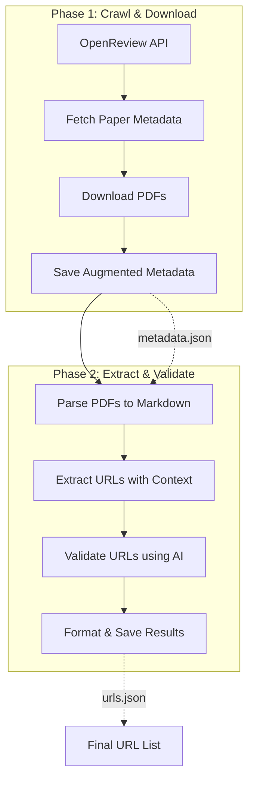
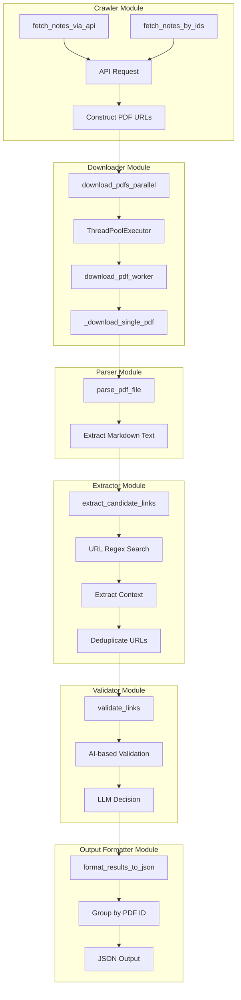
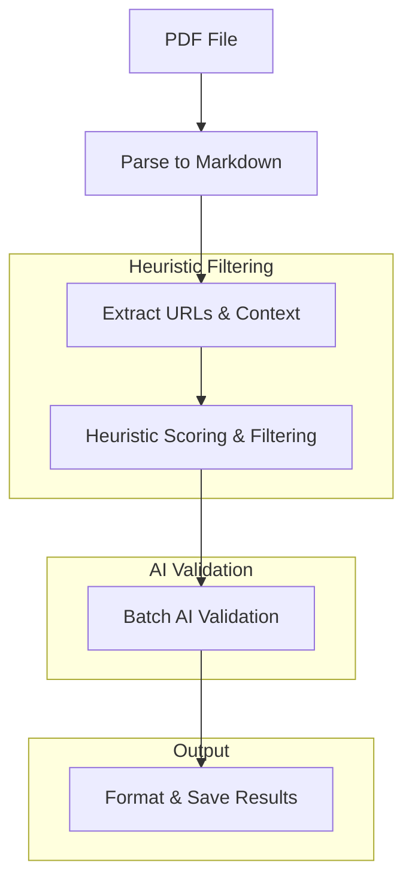

# DataURL-Agent: OpenReview Dataset Link Extractor

This project automatically crawls specified OpenReview conference pages, downloads the associated papers (PDFs), extracts potential dataset and benchmark URLs from them, validates these URLs, and outputs a clean, deduplicated list in JSON format.

## Pipeline Overview

The process is divided into two distinct phases for modularity and easier testing:



### Detailed Component Diagram



## Prerequisites

* Python 3.11+
* Conda or Miniconda

## Installation

1. **Clone the repository:**
   ```bash
   git clone https://github.com/Monthlyaway/DataURL-Agent.git
   cd DataURL-Agent
   ```

2. **Create and activate conda environment:**
   ```bash
   conda create -n aiagent python=3.11
   conda activate aiagent
   ```

3. **Install dependencies:**
   ```bash
   pip install -r requirements.txt
   ```

4. **Configure OpenAI API (Optional for AI validation):**
   Create a `.env` file in `src`/ with:
   ```
   OPENAI_API_KEY=api_key_here
   OPENAI_API_BASE=api_base_here
   ```

## How to Run

### Phase 1: Crawl & Download

This phase fetches metadata and downloads PDFs.

**Command:**

```bash
python -m src.run_crawl --url "<openreview_url>" -o <output_directory> [options]
```

**Required Arguments:**

* `--url "<openreview_url>"`: The complete OpenReview URL (e.g., `"https://openreview.net/group?id=ICLR.cc/2025/Conference#tab-accept-oral"`).

**Optional Arguments:**

* `--paper-ids id1 id2 ...`: Specific paper IDs to fetch (ignores url if provided)
* `-o <output_directory>`: The base directory for outputs (default: `./data`).
* `--limit <number>`: Maximum number of papers to fetch (default: fetch all).
* `-w <number>`, `--workers <number>`: Number of parallel workers for downloading PDFs (default: 5).
* `-v`, `--verbose`: Enable verbose (DEBUG level) logging.

**Example:**

```bash
python -m src.run_crawl --url "https://openreview.net/group?id=ICLR.cc/2025/Conference#tab-accept-oral" -o ./data -w 8 --verbose
```

**Output:**

* PDFs downloaded into `<output_directory>/pdfs/`.
* Augmented metadata saved to `<output_directory>/metadata.json`.

### Phase 2: Extract & Validate

This phase processes the downloaded PDFs to find and validate dataset links.

**Command:**

```bash
python -m src.run_extract --metadata <path_to_metadata.json> -o <path_to_results.json> [options]
```

**Required Arguments:**

* `--metadata <path_to_metadata.json>`: Path to the augmented metadata JSON file generated by Phase 1.
* `-o <path_to_results.json>`: Path where the final results will be saved.

**Optional Arguments:**

* `-w <number>`, `--workers <number>`: Number of parallel workers for processing PDFs (default: 5).
* `-b <number>`, `--batch-size <number>`: **Number of URLs to validate in a single batch (default: 5). Increasing this value can dramatically reduce the number of API calls and speed up processing.**
* `-v`, `--verbose`: Enable verbose (DEBUG level) logging.

**Example:**

```bash
python -m src.run_extract --metadata ./data/metadata.json -o ./data/urls.json -w 4 -b 10 --verbose
```

**Output:**

* A JSON file at `<path_to_results.json>` containing URLs found across all processed papers, grouped by PDF ID.

> **Tip:**
> Setting a larger `--batch-size` (e.g., 10 or 20) can reduce API calls by up to 80-90% compared to validating each URL individually. This is especially useful for large-scale processing and will save both time and cost.

## Testing Individual Modules

Each module can be tested independently to verify functionality:

### 1. Test the Crawler

```bash
python -m src.crawler
```
This will execute the example code in the crawler module to fetch a small sample of papers.

### 2. Test the PDF Parser

```bash
# Edit the test PDF path in parser.py's __main__ section first
python -m src.parser
```
This will parse a sample PDF and output the extracted markdown text.

### 3. Test the URL Extractor

```bash
python -m src.extractor
```
This runs the extractor on a sample markdown text to demonstrate URL extraction and context tracking.

### 4. Test the Output Formatter

```bash
python -m src.output_formatter
```
This runs example code that demonstrates JSON formatting and saving.

### 5. Test the Validator

```bash
python -m src.validator
```
This will test the AI-based URL validation on example URLs.

## Configuration

Key settings are centralized in `src/config.py`. It loads environment variables, as shown in `.env.example`.

* **API Configuration**: Endpoints and request limits
* **Filesystem Paths**: Default output directories and filenames
* **Download Configuration**: Worker count, timeouts, and request headers
* **AI Validation**: OpenAI API settings and context window size
* **Processing Settings**: Default worker counts

## Agent Strategy

The DataURL-Agent employs a multi-stage strategy to identify intentional links to datasets, benchmarks, and code repositories within research papers:



1.  **URL Extraction and Context Gathering:**
    *   The agent first parses the PDF content into Markdown format.
    *   It then uses a regular expression to identify potential URLs within the text.
    *   For each identified URL, it extracts enhanced context, including the full sentence, surrounding paragraph, the title of the section it appears in, and any nearby page hints. It also looks for specific reference patterns (e.g., "available at").

2.  **Heuristic Pre-filtering and Scoring:**
    *   Before involving the AI, the agent applies a heuristic scoring mechanism to pre-filter less likely candidates. This scoring is based on several factors:
        *   **Domain Score:** Assigns points based on the URL's domain (e.g., higher scores for GitHub, Zenodo; lower scores for social media or publisher sites).
        *   **Path Score:** Assigns points based on keywords or file extensions in the URL path (e.g., higher scores for "/dataset", "/code", ".zip", ".csv"; lower scores for "/about", "/contact").
        *   **Context Score:** Assigns points based on the presence of relevant keywords in the surrounding text context (e.g., higher scores for "our code is available", "dataset for this paper"; lower scores for "cited from", "reference from").
        *   **Section Score:** Assigns points based on the title of the section where the URL appears (e.g., higher scores for "Implementation", "Data"; lower scores for "References", "Introduction").
    *   A total score is calculated, and URLs with a low total score are filtered out, reducing the number of candidates sent to the AI.

3.  **Batch AI-based Validation:**
    *   The remaining candidate URLs, along with their extracted context, are sent to an AI model (configured via Langchain and OpenAI API) in **batches** (see `--batch-size`).
    *   The AI analyzes the URL and context based on a specific prompt that guides it to identify intentional links to datasets, benchmarks, or code repositories.
    *   The AI returns a decision (true/false) and a reason in a structured JSON format.

4.  **Output Formatting:**
    *   Results are grouped by PDF and saved in a structured JSON file for downstream use.

This multi-stage approach combines efficient heuristic filtering with the nuanced understanding of an AI model to accurately and efficiently identify relevant links.

## Key Features

* **URL Extraction**: Uses a robust regex pattern to extract URLs from Markdown text
* **Context Tracking**: Stores the surrounding text context for each URL (configurable window size)
* **Parallel Processing**: Multi-threaded downloading and processing for efficiency
* **AI Validation**: Optional LLM-based validation of dataset/repository links
* **Flexible Fetching**: Support for venue-based crawling or specific paper IDs

## Troubleshooting

* **PDF Download Issues**: Check network connectivity and if the specified paper IDs exist.
* **URL Extraction Problems**: Verify the PDFs were properly converted to markdown.
* **AI Validation Errors**: Ensure the OpenAI API key is correctly set in the `.env` file.

## Future Enhancements

* **Improved URL Context Analysis**: Enhance detection of URL purposes from context
* **Additional Data Sources**: Support for other academic repositories beyond OpenReview
* **Result Visualization**: Dashboard for viewing extracted URLs and their validation status