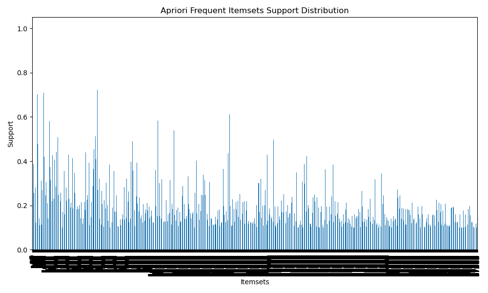
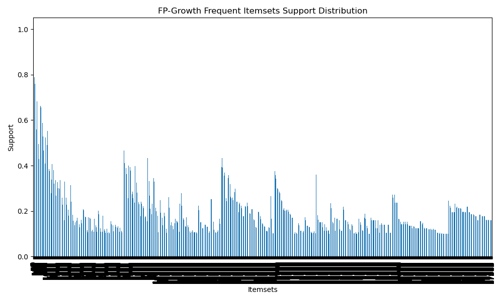
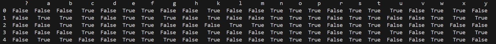

# 频繁项集挖掘算法实现与比较报告

## 引言

频繁项集挖掘是数据挖掘中的一个重要任务，用于从大型数据集中挖掘出经常一起出现的项集。本项目实现了三种常见的频繁项集挖掘算法：

1. **Apriori 算法** ([AS94b])：一种基于候选项集生成和广度优先搜索的经典算法。
2. **FP-Growth 算法** ([HPY00])：一种更高效的算法，通过构建压缩的 FP-树来避免候选项集的生成。
3. **Eclat 算法** ([Zak00])：基于垂直数据格式的算法，通过集合交集进行深度优先搜索来发现频繁项集。

这些算法应用于 **Mushroom 数据集**，并对其性能进行了比较，分析了不同最小支持度阈值、数据集大小和数据分布等情况下各个算法的表现。

## 数据集描述

本项目使用 **Mushroom 数据集**，该数据集来自 UCI 机器学习库，包含 8,124 条记录，每条记录描述一种蘑菇的特征，包括 22 个属性，如 `cap-shape`、`odor`、`gill-attachment` 和 `habitat`。该数据集为分类数据集，包含两个类别：食用蘑菇（`e`）和有毒蘑菇（`p`）。

- **数据集**：Mushroom 数据文件（`mushroom.data`）。
- **特征**：22 个描述蘑菇不同特征的类别属性。
- **目标**：基于蘑菇的特征挖掘频繁项集并生成关联规则。

### 文件结构：
```
Mushroom_Frequent_Itemset_Mining/
├── data/
│   └── mushroom.data                # Mushroom 数据集文件
├── notebooks/
│   └── mushroom_frequent_itemset_mining.ipynb  # Jupyter Notebook 文件
├── src/
│   └── mushroom_preprocessing.py    # 数据预处理脚本
│   └── frequent_itemset_mining.py   # 频繁项集挖掘脚本
├── results/                         # 用于存储结果文件（可选）
└── README.md
```

## 算法描述

### 1. Apriori 算法

**Apriori 算法**使用 **广度优先搜索** 策略生成候选项集，并通过不断剪枝不频繁的项集来找到所有频繁项集。该算法的核心思想是 **Apriori 原则**，即 "如果一个项集是频繁的，那么它的所有子集也一定是频繁的"。


### 2. FP-Growth 算法

**FP-Growth** 算法通过构建一个 **Frequent Pattern Tree (FP-Tree)** 来避免候选项集的生成，避免了 Apriori 算法的多次扫描过程。它只需要两次扫描数据集，在处理大数据时比 Apriori 更高效。


### 3. Eclat 算法

**Eclat 算法**基于 **垂直数据格式**，每个项集由其出现的事务列表（tidsets）表示。Eclat 使用 **深度优先搜索** 和 **集合交集** 来发现频繁项集。它特别适用于稀疏数据集，能够有效地通过垂直格式和集合交集提高计算效率。

## 方法论

### 数据预处理

1. **数据转换**：由于 Mushroom 数据集是类别型的，因此我们将每条记录转换为事务数据格式，以适应频繁项集挖掘算法的输入格式。

2. **频繁项集挖掘**：对转换后的数据应用三种算法，分别使用不同的 **最小支持度阈值** 进行频繁项集挖掘。
3. **结果可视化**：通过柱状图展示每种算法挖掘到的频繁项集的支持度分布。

### 性能比较

我们基于以下几个标准对每种算法进行了性能评估：

- **执行时间**：挖掘频繁项集所用的时间。
- **内存使用情况**：挖掘过程中消耗的内存量。
- **结果质量**：生成的频繁项集的数量和质量。
- **最小支持度的影响**：不同最小支持度阈值对频繁项集数量和执行时间的影响。

## 结果与分析

### 1. 执行时间比较

- **Apriori**：由于 Apriori 需要多次扫描数据并生成候选项集，因此其执行时间随着数据集的增大而迅速增加。尤其是在较低支持度的情况下，生成的候选项集数量会急剧增多，导致执行时间延长。
- **FP-Growth**：FP-Growth 在大多数情况下比 Apriori 更快，特别是在数据集较大的情况下。它通过构建 FP-Tree 来避免候选项集生成，能大幅提高效率。
- **Eclat**：Eclat 在稀疏数据集上表现优异，尤其是在数据中包含大量稀有项集时，它能够通过集合交集和垂直格式快速发现频繁项集。但是，在数据较密集的情况下，它的执行时间可能会长于 FP-Growth。

### 2. 最小支持度的影响

- **高支持度阈值**：当最小支持度阈值设置较高时，所有三种算法都会生成较少的频繁项集，并且执行时间较短。但此时可能会漏掉一些重要的模式。
- **低支持度阈值**：当最小支持度阈值设置较低时，生成的频繁项集会大幅增加，执行时间也随之增加。**Apriori** 算法在低支持度下的性能尤为低下，因为它需要生成大量的候选项集。

### 3. 结果质量

- **Apriori**：在数据集较小且频繁项集明显时，Apriori 的结果质量较高，但在数据稀疏时，生成的项集数量可能过多，影响质量。
- **FP-Growth**：FP-Growth 在大多数情况下能够生成高质量的频繁项集，尤其是在数据密集且支持度较高的情况下。
- **Eclat**：Eclat 在处理稀疏数据集时表现尤为出色，能够快速发现稀有的但有意义的模式。

## 讨论

### 每种算法适用的场景

- **Apriori**：适用于较小或者较少稀疏的数据集，或者频繁项集较为明显的情况。由于其简单性，Apriori 在数据集不大时效果较好。
- **FP-Growth**：适用于大规模或密集的数据集，能够高效地挖掘频繁项集。它避免了候选项集的生成，因此在处理大数据时比 Apriori 更加高效。
- **Eclat**：适用于稀疏数据集，尤其是在数据中存在大量稀有项时，Eclat 能够快速找到这些稀有项集。

### 性能影响因素

- **数据大小**：随着数据集的增大，执行时间会增加，但 FP-Growth 在大数据集上表现更好。
- **数据分布**：稀疏数据集更适合使用 Eclat，而密集数据集则适合 FP-Growth。
- **最小支持度阈值**：较高的支持度阈值会加快算法的执行速度，但也可能错失一些重要模式。较低的支持度阈值则会生成更多项集，增加计算量。

## 结论

本项目比较了三种频繁项集挖掘算法：**Apriori**、**FP-Growth** 和 **Eclat**。每种算法都有其优缺点，选择合适的算法取决于数据集的特点和挖掘任务的要求：

- **Apriori**：适用于较小或低密度数据集，算法简单易实现。
- **FP-Growth**：适用于大规模数据集，性能最优，尤其是数据密集的情况下。
- **Eclat**：适用于稀疏数据集，能够有效找到稀有的频繁项集。

总体而言，**FP-Growth** 在大多数场景下表现更优，尤其是在大数据和密集数据的情况下。

## 未来工作

未来的工作可以集中在通过**并行计算**或**分布式计算**（如 **Apache Spark**）来优化这些算法的性能，尤其是在处理非常大规模的数据集时。